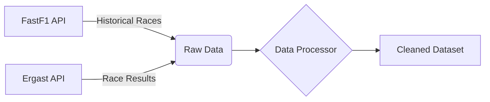
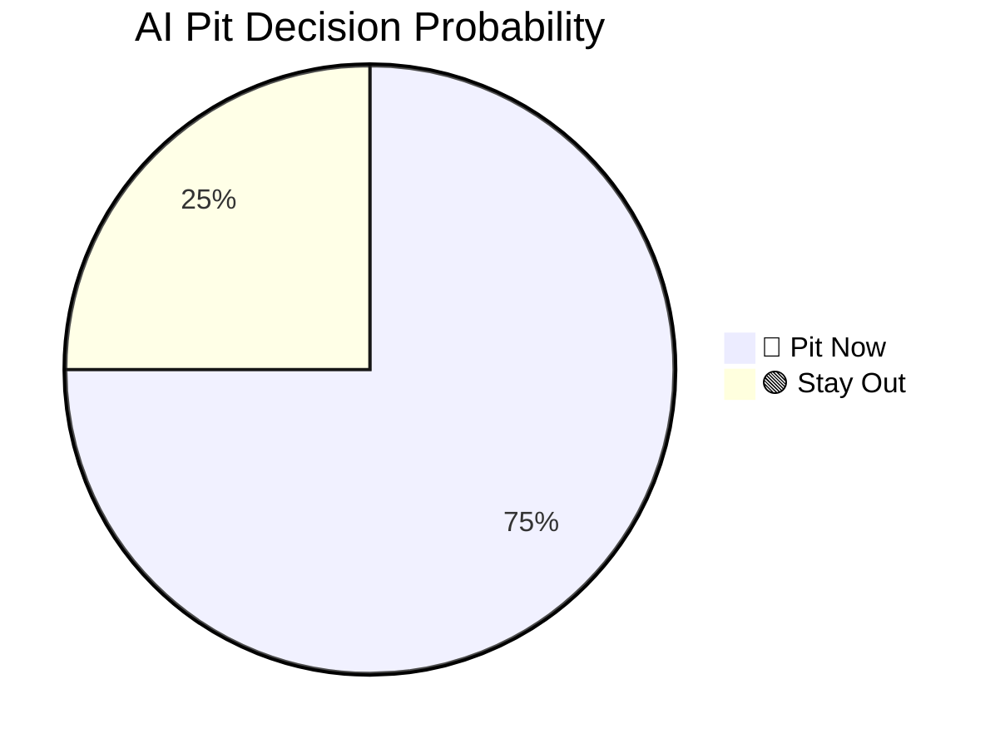

# 🏎️ How the F1 Pit Strategy AI Works

Welcome to the **F1 Pit Strategy AI**! This document explains how the project works in simple terms, using visuals to help you understand what's happening under the hood.

> *In Formula 1, deciding when to change tires is the most critical strategic decision of the race.*

---

## 1. Gathering the Data (Telemetry & History)

Before the AI can give us advice, it needs to learn from past races. We use a library called **FastF1** to download thousands of laps of historical data.

- **What we look at**: Tyres used (Soft, Medium, Hard), lap times, track temperature, and weather.
- **Why it matters**: Soft tyres are very fast but wear out quickly. Hard tyres are slow but last a long time. The AI needs to learn these trade-offs.

## 2. Training the AI

We use an algorithm called **LightGBM** (a type of machine learning model) to study the cleaned dataset. 

It looks for patterns. For example, it might learn: *"If the track is 40°C and a driver has been on Soft tyres for 15 laps, their lap time will suddenly drop by 2 seconds next lap."*

> *The model is trained on tens of thousands of laps to understand exactly when a tire "falls off the cliff" (loses all grip).*

## 3. The Live Pit Decision

Once trained, the AI acts as your **Virtual Race Engineer**. During a live race (or a simulation), you tell it what is happening right now:

- What track are we on?
- What lap is it?
- How hot is the track?

The AI crunches the numbers instantly and outputs a **Probability of Pitting**. If the probability is high enough, it flashes a **🔴 PIT NOW** signal.

## 4. Race Simulation (The "What If?" Machine)

Sometimes, we don't just want a "Pit Now" decision. We want to plan the *entire* race before the lights go out. 

Our simulator runs hundreds of virtual races in seconds. It tries a 1-stop strategy, a 2-stop strategy, pitting early, pitting late, etc. It then ranks them by the total race time.

> *The AI plots each strategy and tells us which one gets us to the finish line the fastest.*

## 5. The Dashboard

All of this complex math is hidden behind a beautiful, F1-themed web dashboard built with **Streamlit**. The dashboard has three main tabs you can explore:

### Tab 1: Live Pit Decision (🛞)
This is for the heat of the race. You enter the exact conditions of the car right now—how old the tyres are, the lap times, track temperature, and position. The AI acts as your race engineer, instantly calculating the math and showing a massive **PIT NOW** or **STAY OUT** banner, along with its statistical confidence.

> *The AI gives you a live percentage probability of whether pitting is the right move right now.*

### Tab 2: Strategy Recommender (🗺️)
This section is for pre-race planning. You tell the system the circuit and the weather conditions. The AI runs all possible strategies (1-stop, 2-stop, early pit, late pit) and ranks them in order of total race time. 

> *The dashboard outputs the top strategies side-by-side so you know your "Plan A" and "Plan B" before the lights go out.*

### Tab 3: Lap Simulator (📈)
This is the visualizer. Choose different pit strategies (e.g., pitting Lap 15 vs Lap 25) and hit simulate. The dashboard graphs the tyre degradation over the whole race. You can see the lines cross as one car "undercuts" another on fresh rubber.

> *Compare strategies visually lap-by-lap to see where you gain or lose time.*

---
**Ready to try it?**
Run `streamlit run app/app.py` in your terminal to open the dashboard!
